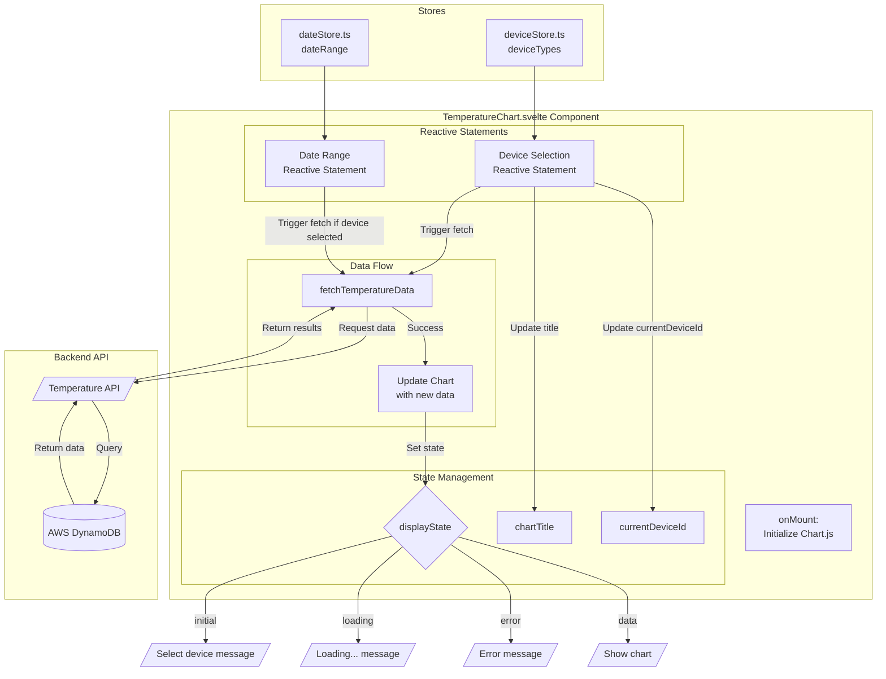

```mermaid
flowchart TB
    subgraph Stores
        deviceStore[deviceStore.ts\ndeviceTypes]
        dateStore[dateStore.ts\ndateRange]
    end

    subgraph "TemperatureChart.svelte Component"
        init[onMount:\nInitialize Chart.js]
        
        subgraph "State Management"
            displayState{displayState}
            chartTitle[chartTitle]
            currentDeviceId[currentDeviceId]
        end

        subgraph "Data Flow"
            fetchTemp[fetchTemperatureData]
            updateChart[Update Chart\nwith new data]
        end

        subgraph "Reactive Statements"
            deviceReactive[Device Selection\nReactive Statement]
            dateReactive[Date Range\nReactive Statement]
        end
    end

    subgraph "Backend API"
        tempAPI[/Temperature API/]
        dynamoDB[(AWS DynamoDB)]
    end

    deviceStore --> deviceReactive
    dateStore --> dateReactive
    
    deviceReactive --> |"Update currentDeviceId"| currentDeviceId
    deviceReactive --> |"Update title"| chartTitle
    deviceReactive --> |"Trigger fetch"| fetchTemp
    
    dateReactive --> |"Trigger fetch if device selected"| fetchTemp
    
    fetchTemp --> |"Request data"| tempAPI
    tempAPI --> |"Query"| dynamoDB
    dynamoDB --> |"Return data"| tempAPI
    tempAPI --> |"Return results"| fetchTemp
    
    fetchTemp --> |"Success"| updateChart
    updateChart --> |"Set state"| displayState
    
    displayState --> |"initial"| initial[/"Select device" message/]
    displayState --> |"loading"| loading[/"Loading..." message/]
    displayState --> |"error"| error[/Error message/]
    displayState --> |"data"| data[/Show chart/]
```